# ExpressVPN和NordVPN哪个好用？- 最新中国翻墙测试报告

本测试报告会长期进行测试，敬请收藏以便以后查看。

`最近测试时间：2020年3月31日`

今天是3月最后一天，这个月的多款VPN的使用还是比较稳定的。但是即使稳定，我想我对各款VPN的测试也不能够停。因为只有这样才能在第一时间发现在中国使用VPN翻墙的具体问题。希望这样的测试能够为各位读者提供使用的一些参考意义。

**今日VPN翻墙测试目录：**
1. ExpressVPN（Windows10+App直连+自动协议）；
2. ExpressVPN（Windows10+App直连+IKEv2）;
3. NordVPN（Windows10+App直连+混淆协议关闭）；

>唠叨一句：我一直希望转达一个信息给各位读者：在可见的未来，防火墙将一直存在；有此墙存在，中国境内用户使用任何一款VPN或其它工具都是一个动态的过程，不存在一劳永逸的方法。

本地测试网络及设备：Windows10/200M电信宽带/有线连接，测速软件为SpeedTest。 

首先我先对本地速度进行一个测试，这样可以为连接VPN后的速度做一个对比参考。如下图所示。

[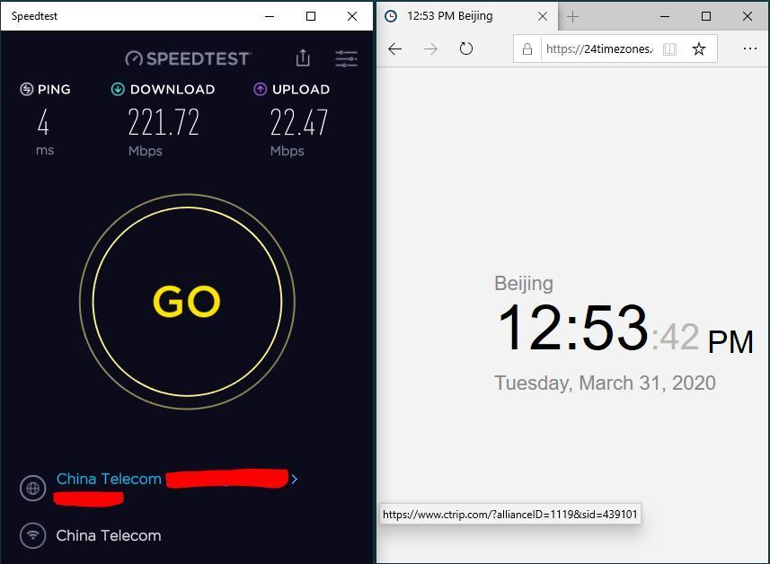](#)

## ExpressVPN Windows 10-APP直连 中国翻墙测试：

官网地址：**<a rel="nofollow noopener" href="https://linkv.org/express" target="_blank"> 获取ExpressVPN优惠</a>**

**开始测试时间**：北京时间2020年03月31日，12:56 PM；

**以下测试连接采用的协议：Automatic（自动）**

Hong Kong – 4：1次连接成功；(SpeedTest Ping：236ms)

[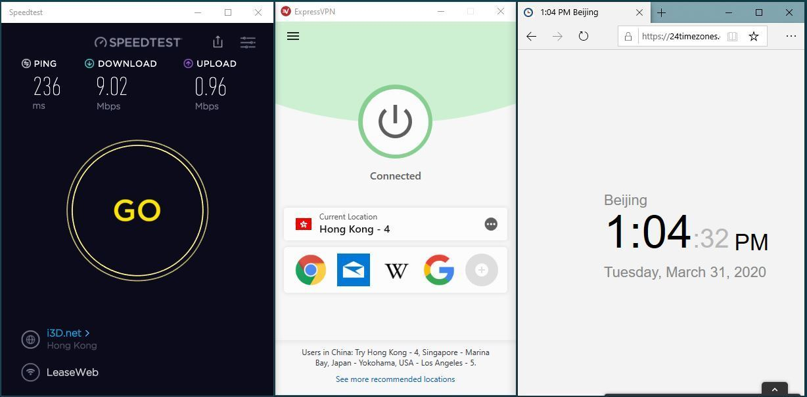](#)

Singapore – Marina Bay：1次连接成功；(SpeedTest Ping：311ms)

[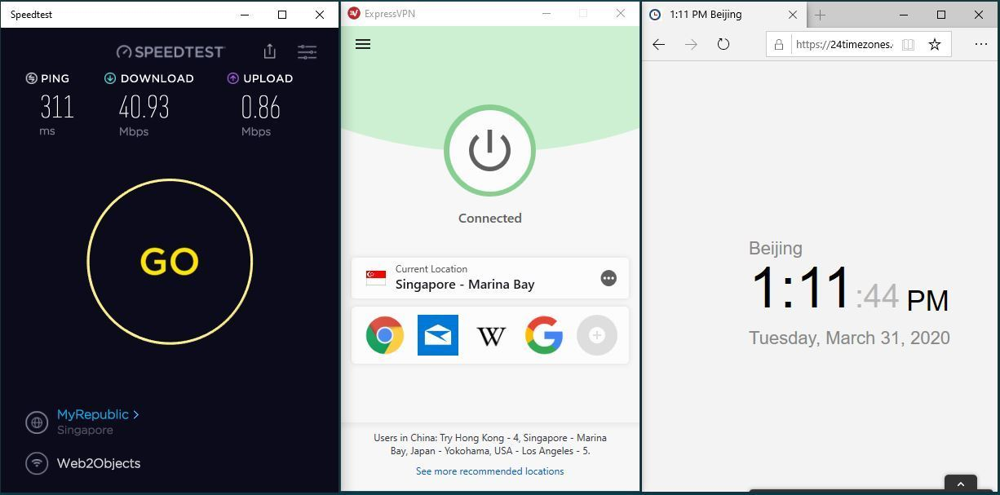](#)

Japan – Yokohama：1次连接成功；(SpeedTest Ping：103ms)

[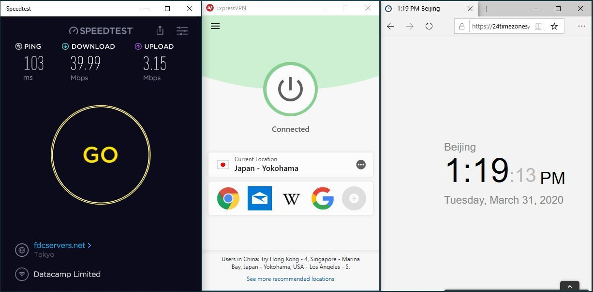](#)

USA – Los Angeles – 5：1次连接成功；(SpeedTest Ping：231ms)

[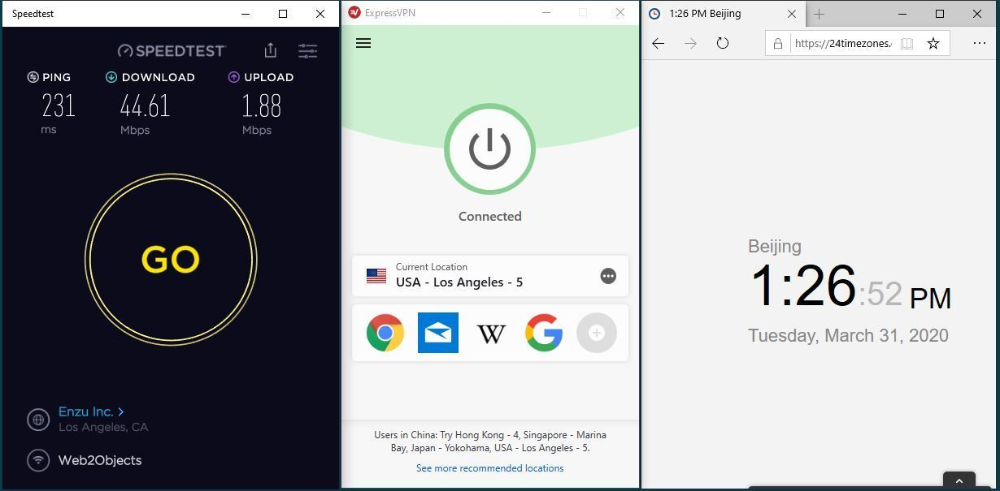](#)

UK – Wembley：1次连接成功；(SpeedTest Ping：332ms)

USA – Santa Monica：1次连接成功；(SpeedTest Ping：177ms)

Canada – Toronto – 2：1次连接成功-秒连；(SpeedTest Ping：379ms)

[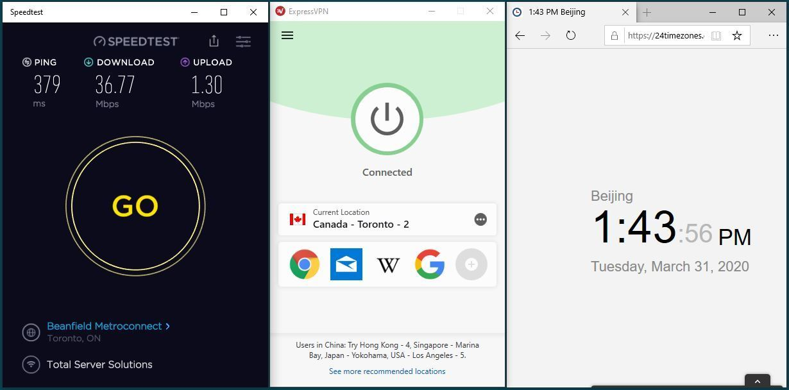](#)

France – Strasbourg：1次连接成功；(SpeedTest Ping：402ms)

[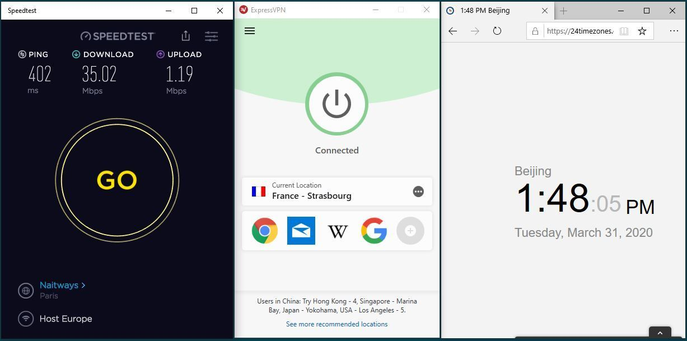](#)

Germany – Nuremberg：1次连接成功；(SpeedTest Ping：410ms)

[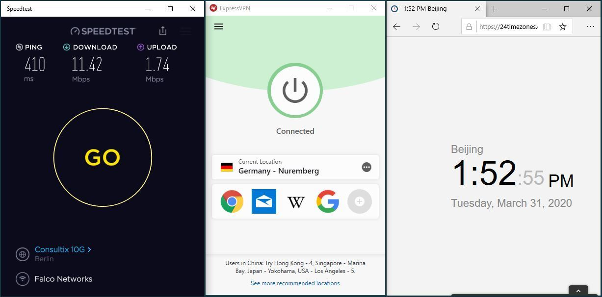](#)

以下测试连接采用的协议：IKEv2

Hong Kong – 2：1次连接成功；(SpeedTest Ping：227ms)

[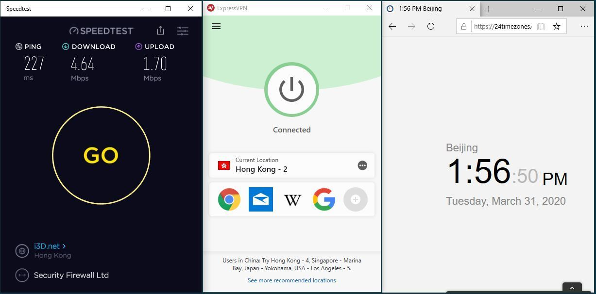](#)

Japan – Tokyo – 2：1次连接成功；(SpeedTest Ping：201ms)

[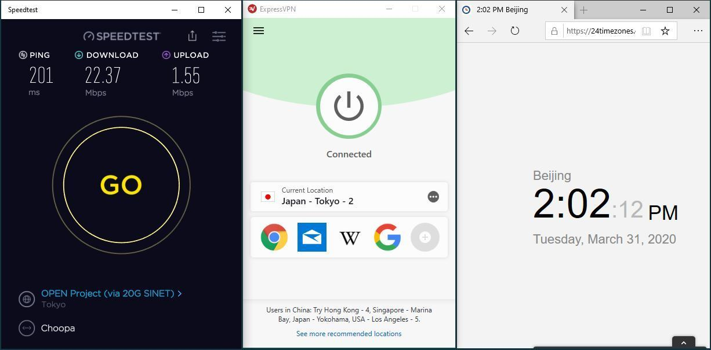](#)

Singapore – CBD：1次连接成功；(SpeedTest Ping：595ms)

Australia – Melbourne：1次连接成功；(SpeedTest Ping：439ms)

[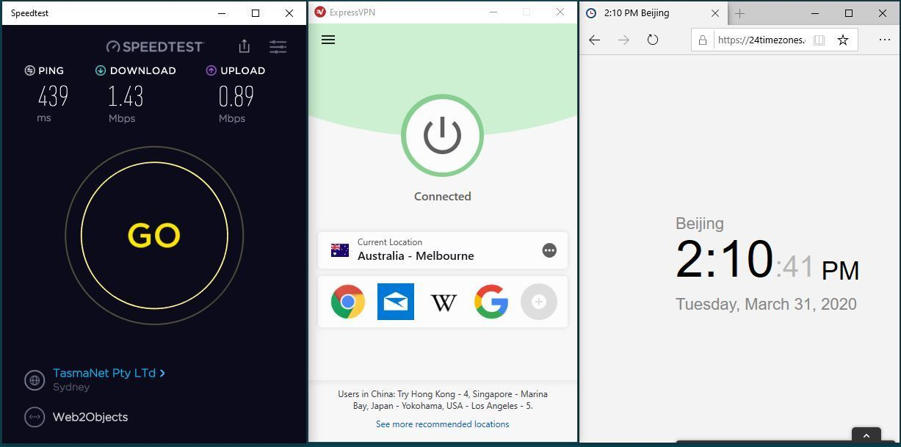](#)

USA – Los Angeles – 4：1次连接成功；(SpeedTest Ping：719ms)

[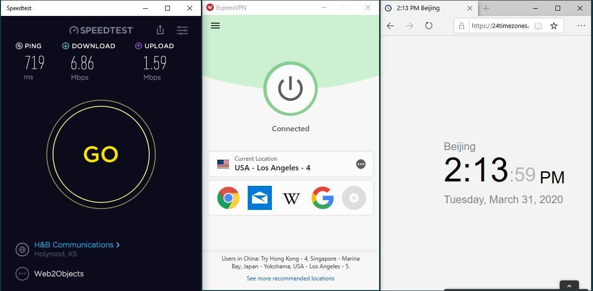](#)

USA – Chicago：1次连接成功；(SpeedTest Ping：533ms)

[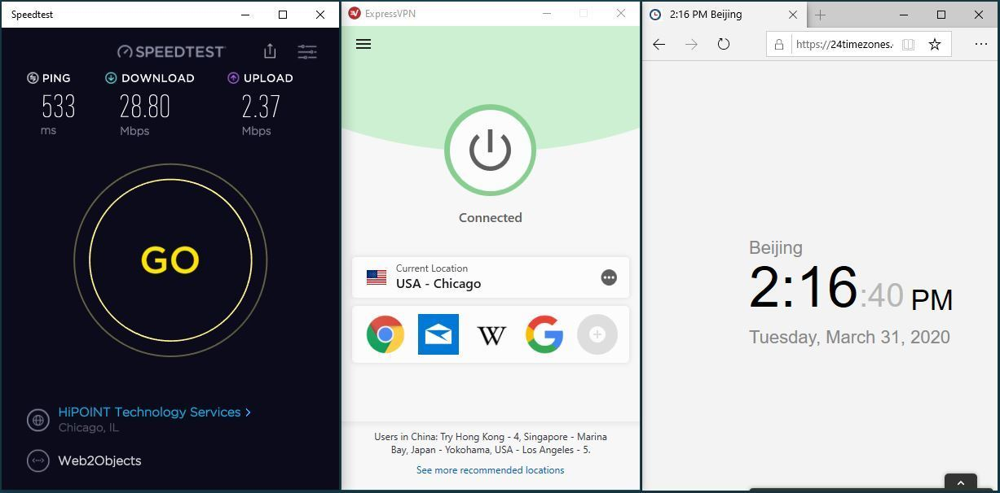](#)

USA – Denver：1次连接成功；(SpeedTest Ping：466ms)

[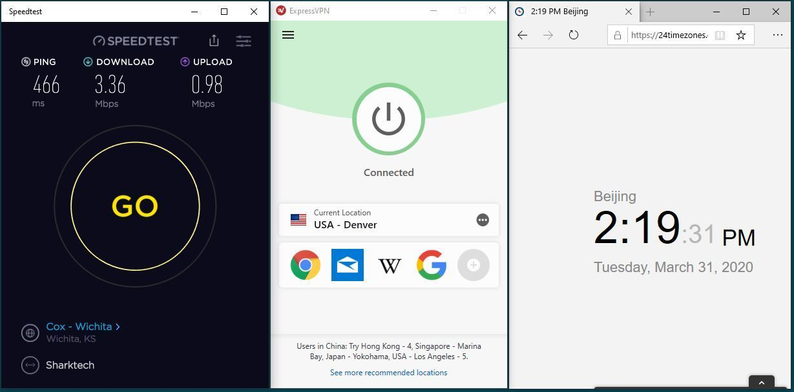](#)

**总结**：今日在Windows10中对ExpressVPN进行测试。通过“自动”和“IKEv2”两种协议进行连接都可以非常顺利的完成。自动协议的测试，服务器选择是针对官方推荐的服务器。而IKEv2则是随机选择服务器进行测试。具体测试的速度大家可以看上面的实际情况。

**ExpressVPN的Win10版本**：7.8.7 (7)；协议设置：自动/IKEv2

**ExpressVPN APP直连 连接成功率 评分：★ ★ ★ ★ ★**

官网地址：**<a rel="nofollow noopener" href="https://linkv.org/express" target="_blank"> 获取ExpressVPN优惠</a>**

## NordVPN Win-APP直连 中国翻墙测试：

NordVPN官网地址：**<a rel="nofollow noopener" href="http://linkv.org/nord" target="_blank"> 获取NordVPN优惠</a>**  （<a rel="nofollow noopener" href="https://github.com/vpncn/vpncn.github.io/blob/master/README.md#%E5%A6%82%E4%BD%95%E6%89%93%E5%BC%80nordvpn%E5%AE%98%E7%BD%91" target="_blank"> 国内如何访问？</a>）

**开始测试时间**：北京时间2020年03月31日，2:25 PM

**Windows10+混淆协议关闭：**

>之前有读者给我反馈说，如果关闭混淆协议可以连接更多的服务器，我想尝试一下，看看效果如何。

测试节点一：“Quick connect” – USA #7144：连接成功；(SpeedTest Ping：432ms)

测试节点一第二次连：“Quick connect” – USA #7144：连接成功；(相同服务器 不测速)

测试节点二：“Quick connect” – Taiwan #34…：连接失败；(长时间连接中状态)

测试节点三：“Quick connect” – USA #7144：连接成功；(相同服务器 不测速)

测试节点四：“Quick connect” – Japan #2093：连接成功；(SpeedTest Ping：249ms)

测试节点五：“Japan” – Japan #2093：连接成功；(相同服务器 不测速)

测试节点六：“Germany” – Japan #2093：连接成功；(相同服务器 不测速)

测试节点一：“Hong Kong” – USA #7144：连接成功；(相同服务器 不测速)

测试节点一：“Canada” – USA #7144：连接成功；(相同服务器 不测速)

测试节点一：“United Kingdom” – UK #1400：连接成功；(SpeedTest Ping：422ms)

[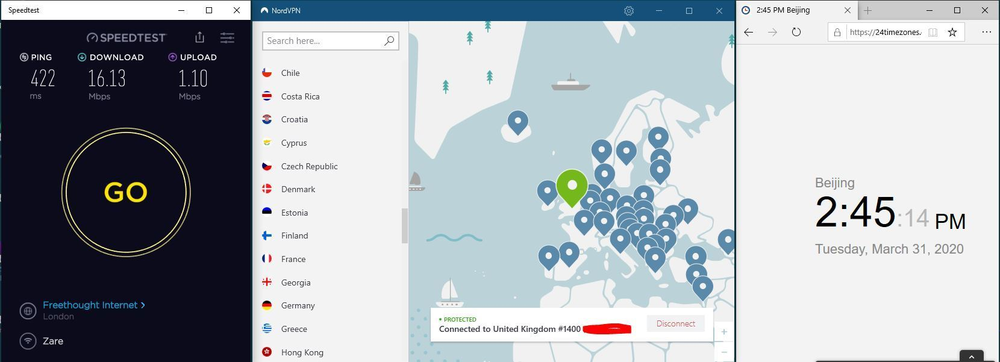](#)

测试节点一：“United States” – USA #3354：连接成功；(SpeedTest Ping：383ms)

[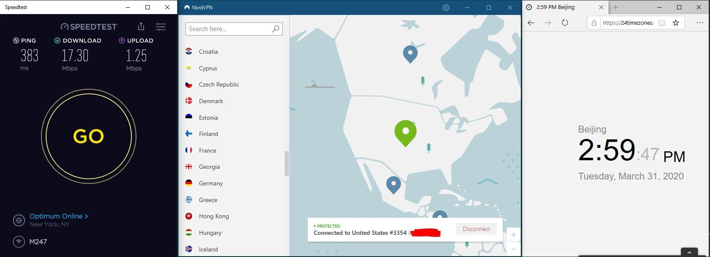](#)

测试节点一：“United States” – USA #2987：连接成功；(SpeedTest Ping：332ms)

[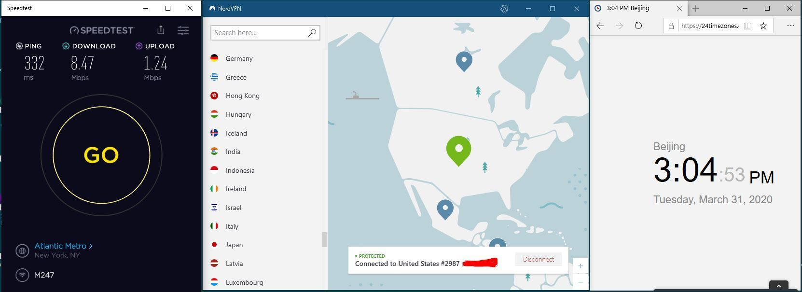](#)

测试节点一：“United States” – USA #4318：连接成功；(SpeedTest Ping：280ms)

[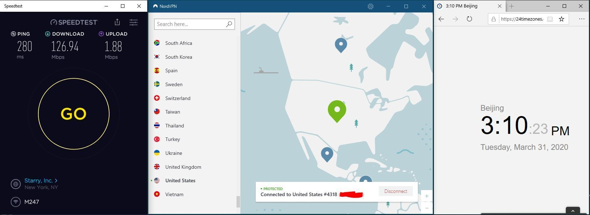](#)

**总结**：今天将NordVPN的“混淆协议关闭”后在进行连接测试，效果非常棒！因为之前在“混淆协议”的服务器中能连接成功服务器只有USA #7144和Japan #2093。但是现在却可以连接更多的服务器，我以上只是测试了部分的情况，如果你有时间可以尝试更多地区的服务器连接。这次测试我没有对“混淆协议开启”进行测试，但根据“混淆协议关闭”也是可以连接成功USA #7144和Japan #2093这两个服务器的，我想开启状态应该也是没有问题的。

>这样的实战测试经验，是无法在官方获得的，希望能够为读者提供更加实际有效的VPN中国翻墙经验。另外还有其它读者反馈，其手动配置OpenVPN在Window中的表现也非常不错。速度可能比App直连还要快，有感兴趣的读者可以自己尝试一下。

Windows10 NordVPN版本：6.27.11.0；协议：混淆关闭

NordVPN 连接成功率 评分：★ ★ ★ ★ ☆

NordVPN官网地址：**<a rel="nofollow noopener" href="http://linkv.org/nord" target="_blank"> 获取NordVPN优惠</a>**（<a rel="nofollow noopener" href="https://github.com/vpncn/vpncn.github.io/blob/master/README.md#%E5%A6%82%E4%BD%95%E6%89%93%E5%BC%80nordvpn%E5%AE%98%E7%BD%91" target="_blank"> 国内如何访问？</a>）
