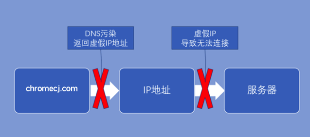
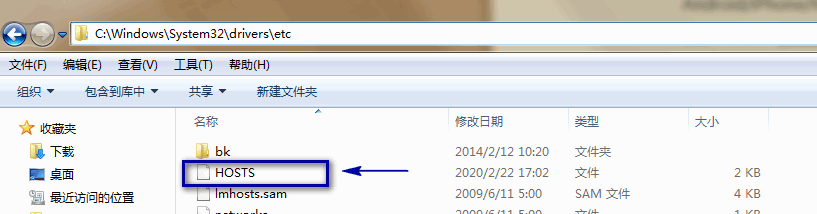
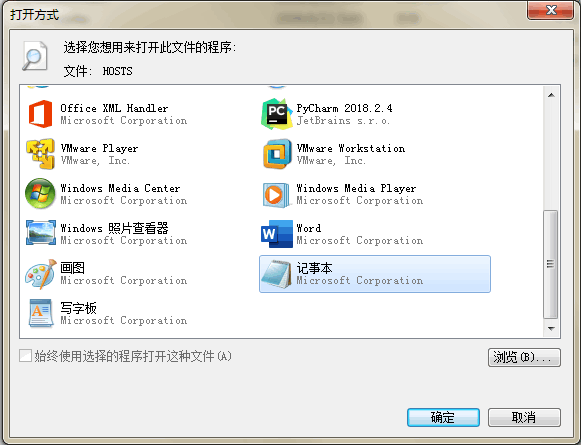
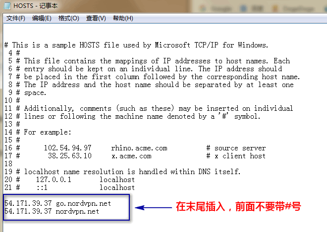

# 如何修改Hosts文件

## 1.什么是 DNS 污染

>有时你会发现，某些网站在国内网站无法访问，一般有三种可能：1.这个网站关闭了；2.被墙了；3.被DNS 污染了。像在国内被屏蔽的中小型网站网站就属于第 3 种，通过修改电脑和手机Hosts文件多数可以解决这个问题。但是像Google、Youtube、Facebook、Twitter等这些大网站和手机上的APP是直接被墙了，这种办法就行不通了，只能找梯子翻墙访问。

hosts文件可以视为一个系统本地上启用的DNS服务器，我们通过编辑它能把域名定向到正确的ip，可以解锁在国内受到DNS污染的网站服务。hosts是一个系统文件，在Windows系统下位于`C:\windows\system32\drivers\etc`，这个文件没有后缀，你可以用文字处理软件去编辑它，要注意的是它是一个系统保护的文件，所以需要用管理员权限才可以编辑。

## 2.DNS污染咋解决

修改电脑和手机`Hosts`文件，可以绕过 DNS 为域名指定正确的 IP 地址。Hosts文件的位置如下（安卓需要 root，iPhone 需要越狱，Windows/Mac/Linux 可以直接修改）

### 2.1 Hosts文件位置

Windows系统: C:\Windows\System32\drivers\etc

直接把文件位置复制到文件夹地址栏，按`Enter`键就看到了。

Android/iPhone/Mac/Linux: /etc/hosts

>技术小白还是建议在电脑上进行操作，更为方便。

### 2.2 如何修改Hosts

以Windows系统为例，打开文件夹C:\Windows\System32\drivers\etc，把 hosts文件移动到桌面，打开方式选择记事本。

在末尾处添加ip地址和域名（之间加一个空格），保存文件并重新移动回C:\Windows\System32\drivers\etc 覆盖掉之前的Host文件，最后打开浏览器设置，清空浏览器缓存，即可访问。

## 网站域名与对应 IP

### 1.NordVPN

插入这2行：

54.171.39.37 go.nordvpn.net

54.171.39.37 nordvpn.net

### 2.PureVPN

插入这3行：

104.18.76.57 billing.purevpn.com

104.16.113.39 www.purevpn.com

104.18.193.71 my.purevpn.com

### 3.IVacy

插入这2行：

104.18.200.99 www.ivacy.com

104.17.69.88 billing.ivacy.com